# HƯỚNG DẪN TỪ SỐ 0: XÂY DỰNG HOME VÀ LOGIN BẰNG HTML + CSS

**Đề bài:** Bài tập tự học chương 2 – HTML–CSS–Layout Website. **Đối tượng:** người chưa biết lập trình web. **Phạm vi:** hai layout nhìn thấy trong ảnh đề bài: Home và Login. **Không làm Responsive, JavaScript, backend, cơ sở dữ liệu hoặc xác thực tài khoản.** Ví dụ minh họa chọn website khóa học **EduShop**; khi làm bài thật, thay tên, ảnh, nội dung theo đề tài nhóm.

> **Cách dùng hướng dẫn:** Làm tuần tự bước 01 → 16. Ở mỗi bước, đọc phần *Khái niệm* → thực hiện *Thao tác* → xem *Kết quả cần quan sát*. Bạn có thể mở các file mã nguồn mẫu đi kèm để chép chính xác những đoạn dài. Không cần cài web server: mở `index.html` bằng Chrome/Edge là đủ cho hai trang tĩnh này.

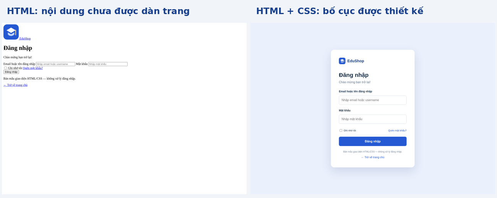

**Hiểu mục tiêu:** HTML tạo **nội dung và cấu trúc** giống như khung một ngôi nhà; CSS quy định **màu, kích thước, khoảng cách, vị trí**, giống như thiết kế và trang trí. Trình duyệt đọc hai loại file này để hiển thị trang. Ở bài này, nhấp nút Đăng nhập **không xác minh tài khoản**; nhấp Tìm kiếm **không tìm dữ liệu**. Các liên kết giữa các trang và liên kết cuộn đến khu vực trong cùng trang vẫn hoạt động vì trình duyệt hỗ trợ sẵn.

---

## BƯỚC 01 — Chuẩn bị công cụ và hiểu từ vựng cơ bản

**Khái niệm:** *Trình soạn thảo mã (code editor)* là phần mềm gõ và lưu mã dưới dạng văn bản, ví dụ Visual Studio Code (VS Code). *Trình duyệt (browser)* là Chrome hoặc Edge, dùng để mở và xem kết quả. *File* là một tệp trên máy; *thư mục (folder)* chứa các tệp; *đuôi file (extension)* cho biết loại tệp, ví dụ `.html`, `.css`, `.svg`.

**Khi nào dùng:** Dùng VS Code khi viết/sửa HTML, CSS; dùng trình duyệt khi kiểm tra giao diện. Đây là hai công cụ khác vai trò, không phải hai ngôn ngữ lập trình.

**Thao tác:**

1. Nếu chưa có, cài VS Code từ trang chính thức `https://code.visualstudio.com/` hoặc dùng trình soạn thảo văn bản thuần bất kỳ. Chuẩn bị Chrome/Edge.
2. Giải nén gói bài mẫu được cung cấp. Tạo một thư mục riêng nếu tự làm từ đầu, ví dụ `website-project` trên Desktop.
3. Mở VS Code → **File → Open Folder...** → chọn thư mục đó. Bên trái là Explorer hiển thị các file; giữa màn hình là vùng gõ mã.
4. Khi sửa một file, nhấn **Ctrl + S** để lưu. Mở trang ở trình duyệt và nhấn **Ctrl + R** để xem thay đổi. Trên macOS, thường dùng **Cmd + S** và **Cmd + R**.

**Kết quả cần quan sát:** Có một thư mục dự án được mở trong VS Code. Chưa cần nhìn thấy website. Lỗi phổ biến: lưu file thành `index.html.txt` vì Windows đang ẩn đuôi tệp; hãy kiểm tra tên thật của file.

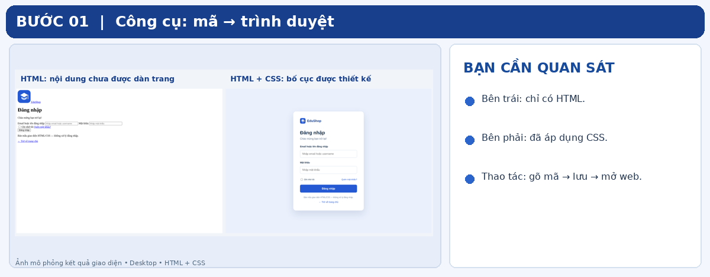

## BƯỚC 02 — Tạo cấu trúc dự án, học cách đọc đường dẫn

**Khái niệm:** *Cấu trúc thư mục* là cách sắp xếp file. *Đường dẫn tương đối (relative path)* chỉ vị trí file tính từ file đang dùng. Ví dụ, từ `index.html`, `css/style.css` nghĩa là vào thư mục `css` và lấy file `style.css`. Trong file CSS ở bên trong `css/`, đường dẫn đến thư mục cùng cấp với `css` phải dùng `../`.

**Khi nào dùng:** Mọi khi trang cần liên kết tới file CSS, ảnh, hoặc trang HTML khác. Đường dẫn sai khiến ảnh không hiện hoặc trang mất toàn bộ định dạng.

**Thao tác:** Trong Explorer của VS Code, tạo đúng cây file sau bằng nút **New Folder** và **New File**. Nếu dùng gói mẫu, cây này đã có sẵn.

```text
website-project/
├── index.html              ← trang Home
├── login.html              ← trang Login
├── css/
│   ├── style.css           ← CSS dùng chung
│   ├── home.css            ← CSS chỉ dành cho Home
│   └── login.css           ← CSS chỉ dành cho Login
└── assets/
    ├── logo.svg
    ├── banner.svg
    ├── course-html.svg
    ├── course-css.svg
    └── course-design.svg
```

**Lưu ý:** Ảnh SVG có sẵn trong gói; bạn không cần tự vẽ. SVG là định dạng ảnh dựa trên hình học, trình duyệt hiển thị được bằng thẻ ``. Sau này có thể thay bằng JPG/PNG thật nếu thay đổi đường dẫn trong HTML cho đúng.

**Kết quả cần quan sát:** Tất cả tên file và thư mục khớp với cây trên, nhất là chữ thường/chữ hoa và dấu gạch ngang.

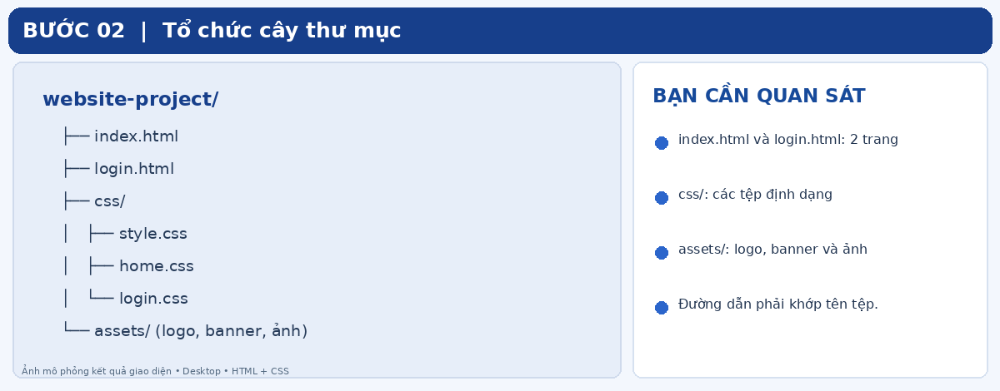

## BƯỚC 03 — Tạo khung trang HTML đầu tiên

**Khái niệm:** *HTML* (HyperText Markup Language) là ngôn ngữ đánh dấu cấu trúc. *Thẻ (tag)* thường gồm thẻ mở `<p>` và thẻ đóng `</p>`; phần nằm giữa là nội dung. *Phần tử (element)* gồm thẻ cùng nội dung. *Thẻ lồng nhau* nghĩa là một phần tử nằm trong phần tử khác. *Thuộc tính (attribute)* cung cấp thông tin thêm, ví dụ `lang="vi"`. *Indentation* là thụt đầu dòng để dễ nhìn, không phải hiệu ứng trên web.

**Khi nào dùng:** Mọi trang HTML đều cần khung tài liệu. Phần `head` chứa thông tin cấu hình, thường không xuất hiện như nội dung chính; phần `body` chứa nội dung người xem nhìn thấy.

**Thao tác:** Mở `index.html`, gõ rồi lưu:

```html
<!DOCTYPE html>
<html lang="vi">
<head>
  <meta charset="UTF-8">
  <title>EduShop - Trang chủ</title>
  <link rel="stylesheet" href="css/style.css">
  <link rel="stylesheet" href="css/home.css">
</head>
<body>
  <h1>Xin chào! Đây là trang Home.</h1>
</body>
</html>
```

**Giải thích từng dòng:** `<!DOCTYPE html>` thông báo tài liệu HTML5; `<html lang="vi">` cho biết ngôn ngữ trang là tiếng Việt; `<meta charset="UTF-8">` giúp hiển thị dấu tiếng Việt; `<title>` hiển thị tên trên tab trình duyệt; `<link rel="stylesheet" href="...">` yêu cầu trình duyệt đọc file CSS; `<body>` bao toàn bộ giao diện; `<h1>` là tiêu đề chính.

**Kết quả cần quan sát:** Nhấp đúp `index.html` trong File Explorer → trình duyệt hiện dòng “Xin chào! Đây là trang Home.”. Trang còn rất đơn giản là đúng; ta chưa thêm layout. Nếu chữ tiếng Việt lỗi dấu, kiểm tra `charset="UTF-8"` và lưu file bằng UTF-8.

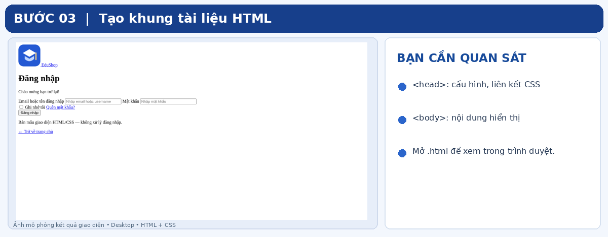

## BƯỚC 04 — Viết CSS chung: làm quen quy tắc, class và Box Model

**Khái niệm:** *CSS* (Cascading Style Sheets) định dạng phần tử HTML. Một quy tắc CSS có **bộ chọn (selector)** và các cặp **thuộc tính: giá trị (property: value)**. Ví dụ `.container { width: 1100px; }`: `.container` chọn mọi phần tử có `class="container"`; `width` là thuộc tính; `1100px` là giá trị (px = pixel CSS). *Class* là nhãn tái sử dụng cho nhiều phần tử. Dấu `.` trong CSS chỉ bộ chọn class, **không viết dấu chấm** trong giá trị HTML `class="container"`.

**Box Model** (mô hình hộp): từ trong ra ngoài gồm **content** (nội dung) → **padding** (khoảng đệm trong) → **border** (đường viền) → **margin** (khoảng cách ngoài). `box-sizing: border-box` giúp `width` tính cả padding và border, dễ dự tính kích thước.

**Khi nào dùng:** `style.css` chứa quy tắc được dùng trên nhiều trang, ví dụ font chữ, nút, logo; không cần viết lặp lại trong `home.css` và `login.css`.

**Thao tác:** Mở `css/style.css`, viết tối thiểu:

```css
* { box-sizing: border-box; }
body {
  margin: 0;
  font-family: Arial, sans-serif;
  color: #18304a;
}
.container {
  width: 1100px;
  margin: 0 auto;
}
```

**Giải thích:** `*` chọn tất cả phần tử; `margin: 0` bỏ khoảng trắng mặc định quanh toàn trang; `font-family` chọn phông chữ; `color` là màu chữ; `#18304a` là mã màu thập lục phân (hex); `margin: 0 auto` căn giữa khối có `width` xác định theo chiều ngang. Đây là bố cục dành cho desktop, **không viết media query/responsive**.

**Kết quả cần quan sát:** Sau Ctrl + S rồi Ctrl + R, dòng tiêu đề không còn bị cách mép trình duyệt bởi margin mặc định. Trong gói mã nguồn mẫu, `style.css` còn có phần CSS chung cho header, footer, nút; hãy dùng đủ nội dung file mẫu khi muốn có kết quả giống ảnh.

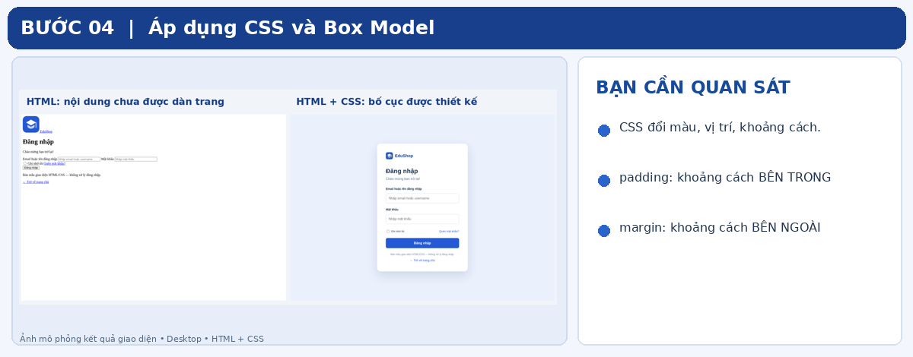

## BƯỚC 05 — Tạo Header, Logo và thanh điều hướng

**Khái niệm:** *Header* là vùng đầu trang, thường chứa *logo* và *navigation/menu* (liên kết điều hướng). `<header>` cho biết vùng đầu trang; `<nav>` chứa các liên kết điều hướng; `<a href="...">` là liên kết. *Flexbox* là cơ chế bố cục CSS giúp xếp các phần tử thành hàng hoặc cột. `display: flex` bật Flexbox; `justify-content: space-between` đẩy hai nhóm về hai đầu; `align-items: center` căn giữa theo chiều dọc; `gap` tạo khoảng cách giữa các mục.

**Khi nào dùng:** Header phù hợp với Flexbox vì logo ở bên trái, menu ở bên phải trên cùng một hàng.

**Thao tác:** Trong `index.html`, thay dòng `<h1>Xin chào...` bằng khối đầu tiên nằm trong `<body>`:

```html
<header class="site-header">
  <div class="container header-content">
    <a class="brand" href="index.html">
       EduShop
    </a>
    <nav class="main-nav">
      <a href="index.html">Trang chủ</a>
      <a href="#danh-muc">Danh mục</a>
      <a href="#san-pham">Khóa học</a>
      <a href="#gioi-thieu">Giới thiệu</a>
      <a href="login.html">Đăng nhập</a>
    </nav>
  </div>
</header>
```

Thêm vào `css/style.css`:

```css
.header-content {
  height: 82px;
  display: flex;
  justify-content: space-between;
  align-items: center;
}
.main-nav { display: flex; gap: 26px; }
```

**Giải thích đường dẫn:** `href="login.html"` dẫn sang trang Login cùng thư mục; `href="#san-pham"` dẫn tới phần tử trong **cùng trang** có `id="san-pham"` (ta sẽ tạo ở bước 09). `src` trong `` là nguồn ảnh; `alt` là mô tả ảnh khi ảnh không tải được hoặc cho công cụ hỗ trợ đọc màn hình. `div` là hộp chứa nhóm phần tử; bản thân `div` không mang ý nghĩa nội dung cụ thể.

**Kết quả cần quan sát:** Logo/tên website bên trái, menu bên phải. Các liên kết có thể điều hướng; liên kết đến `#san-pham` chưa cuộn đúng trước khi tạo `id` tương ứng. Xem ảnh Home ở bước 11.

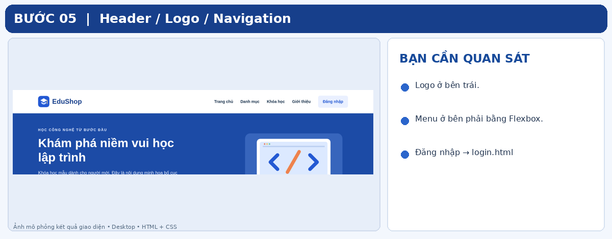

## BƯỚC 06 — Xây dựng Banner / Hero

**Khái niệm:** *Hero* là vùng lớn nổi bật gần đầu trang, gồm tiêu đề, mô tả, ảnh và nút kêu gọi hành động (*CTA* – Call to Action). `<main>` đánh dấu nội dung chính; `<section>` gom một khu vực theo chủ đề; `<h1>` dành cho tiêu đề trang, `<h2>` cho các khu vực bên trong. `class="hero"` nối một phần tử HTML với CSS `.hero`. *Background* là nền của khối; `padding` tạo khoảng đệm bên trong.

**Khi nào dùng:** Home cần banner giới thiệu website, có thể thay banner khóa học bằng sản phẩm/du lịch/ẩm thực theo đề tài nhóm.

**Thao tác:** Ngay sau `</header>` thêm:

```html
<main>
  <section class="hero">
    <div class="container hero-content">
      <div>
        <h1>Khám phá niềm vui học lập trình</h1>
        <p>Khóa học mẫu dành cho người mới.</p>
        <a class="button" href="#san-pham">Xem khóa học</a>
      </div>
      
    </div>
  </section>
</main>
```

Trong `css/home.css` thêm:

```css
.hero { background: #1c4ba6; color: white; }
.hero-content {
  height: 360px;
  display: flex;
  align-items: center;
  justify-content: space-between;
}
.hero-content img { width: 385px; }
```

**Giải thích:** `background` định dạng nền; `color: white` đổi màu chữ; `height` quy định chiều cao; `width` giới hạn độ rộng ảnh. Thẻ `<a>` được thiết kế giống nút bằng class `.button` nhưng về bản chất vẫn là liên kết cuộn đến khóa học. Trong source mẫu, màu sắc và khoảng cách được bổ sung để đẹp hơn.

**Kết quả cần quan sát:** Khối nền xanh bên dưới menu, nội dung bên trái, hình máy tính bên phải. Nếu ảnh không hiện, kiểm tra `assets/banner.svg` có thật và đường dẫn viết chính xác.

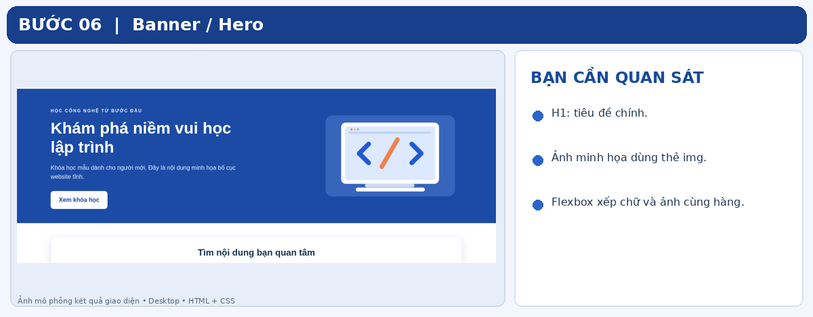

## BƯỚC 07 — Thiết kế thanh tìm kiếm (chỉ giao diện)

**Khái niệm:** `<input>` là ô nhận dữ liệu từ người dùng; `type="search"` cung cấp kiểu ô tìm kiếm có sẵn của trình duyệt; `placeholder` là gợi ý hiện khi ô trống, **không phải nội dung đã nhập**. `<button type="button">` tạo nút bình thường, không tự gửi biểu mẫu. `flex: 1` giúp ô tìm kiếm chiếm phần không gian còn lại trong một hàng Flexbox.

**Khi nào dùng:** Khi cần mô phỏng giao diện tìm nội dung mà **không** xây dựng thuật toán tìm kiếm. HTML/CSS có thể hiển thị và cho gõ chữ, nhưng không thể tự tìm kiếm dữ liệu của website.

**Thao tác:** Trong `<main>`, thêm sau `</section>` của Hero, nhưng **trước** `</main>`:

```html
<section class="container search-section">
  <h2>Tìm nội dung bạn quan tâm</h2>
  <div class="search-box">
    <input type="search" placeholder="Ví dụ: HTML, CSS...">
    <button type="button" class="button">Tìm kiếm</button>
  </div>
</section>
```

Trong `css/home.css` thêm:

```css
.search-section { text-align: center; padding: 25px; margin-top: 35px; }
.search-box { display: flex; width: 700px; gap: 10px; margin: auto; }
.search-box input { flex: 1; padding: 13px; }
```

**Giải thích:** `text-align: center` căn giữa chữ; `margin-top` tạo khoảng cách với Hero; `flex: 1` giãn ô tìm kiếm; nút chỉ được trang trí bằng CSS. Nếu nhấn Tìm kiếm mà không có kết quả là **đúng phạm vi đề**.

**Kết quả cần quan sát:** Một tiêu đề, một ô nhập dài, nút Tìm kiếm nằm ngay bên cạnh. Bạn gõ chữ được vào ô nhưng nhấn nút không tạo kết quả tìm kiếm.

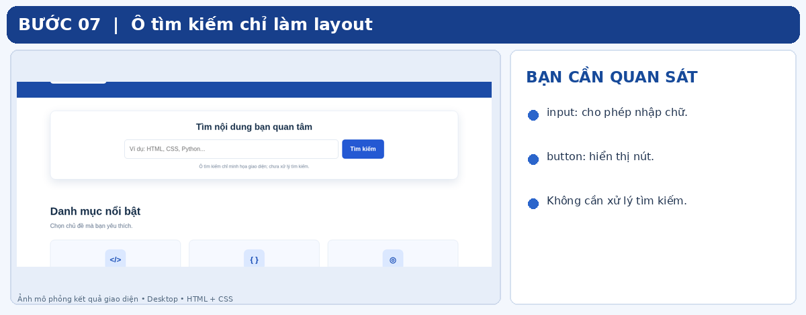

## BƯỚC 08 — Danh mục: tạo ba thẻ bằng CSS Grid

**Khái niệm:** *Card* là khối nội dung hình thẻ; *Grid* là hệ thống hàng/cột trong CSS. `display: grid` bật lưới; `grid-template-columns: repeat(3, 1fr)` tạo 3 cột bằng nhau; `fr` là đơn vị chia phần không gian còn lại; `gap` là khoảng cách giữa các thẻ. `<article>` biểu diễn một mục nội dung có thể đứng riêng, thích hợp cho danh mục hoặc sản phẩm.

**Khi nào dùng:** Hiển thị nhiều thành phần cùng cấu trúc thành cột; Grid phù hợp hơn việc tự viết vị trí `left/top` cho từng thẻ.

**Thao tác:** Sau phần tìm kiếm trong `<main>`:

```html
<section class="container content-section" id="danh-muc">
  <h2>Danh mục nổi bật</h2>
  <div class="category-grid">
    <article class="category-card"><h3>Lập trình Web</h3><p>HTML và CSS cơ bản</p></article>
    <article class="category-card"><h3>Lập trình Game</h3><p>Ý tưởng và trò chơi</p></article>
    <article class="category-card"><h3>Thiết kế số</h3><p>Sáng tạo sản phẩm</p></article>
  </div>
</section>
```

Thêm CSS:

```css
.category-grid { display: grid; grid-template-columns: repeat(3, 1fr); gap: 22px; }
.category-card { padding: 25px; border: 1px solid #dce5f1; border-radius: 12px; }
```

**Giải thích:** `id="danh-muc"` là định danh **duy nhất trong trang** để menu `href="#danh-muc"` tìm thấy; khác với class có thể dùng lặp nhiều lần. `border` là đường viền; `border-radius` bo góc. Không cần bọc ba thẻ trong ba hàng thủ công: Grid tự xếp thành cột.

**Kết quả cần quan sát:** Ba ô danh mục cùng chiều rộng trên một hàng. Thử nhấn liên kết Danh mục trên header → trình duyệt cuộn đến vùng này.

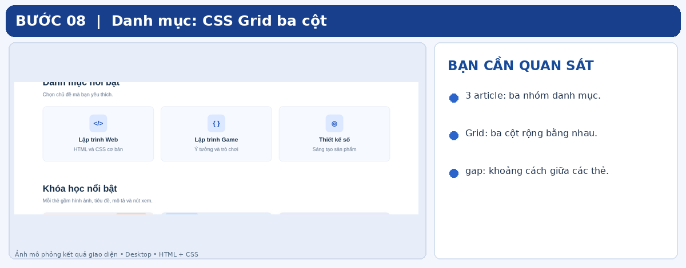

## BƯỚC 09 — Sản phẩm / dịch vụ nổi bật: dùng thẻ và ảnh

**Khái niệm:** *Product card* là thẻ có hình, tên, mô tả, liên kết. `img` là phần tử ảnh, `src` là đường dẫn; `alt` mô tả ảnh. `object-fit: cover` khiến ảnh lấp đầy vùng có kích thước cố định (có thể bị cắt phần rìa), giúp các thẻ cân đối. `overflow: hidden` giấu phần ảnh tràn qua viền bo góc.

**Khi nào dùng:** Danh sách khóa học, sản phẩm bán hàng, dịch vụ hoặc bài viết giới thiệu đều dùng cách thiết kế thẻ tương tự.

**Thao tác:** Sau section danh mục, thêm section có `id="san-pham"` và cấu trúc mẫu một thẻ dưới đây; **sao chép thêm hai thẻ** và đổi ảnh, tiêu đề, mô tả như file `index.html` đi kèm:

```html
<section class="container content-section" id="san-pham">
  <h2>Khóa học nổi bật</h2>
  <div class="product-grid">
    <article class="product-card">
      
      <div class="product-body">
        <h3>HTML cho người mới</h3>
        <p>Học cách tạo cấu trúc một trang web.</p>
        <a href="#san-pham">Xem chi tiết →</a>
      </div>
    </article>
  </div>
</section>
```

CSS:

```css
.product-grid { display: grid; grid-template-columns: repeat(3, 1fr); gap: 22px; }
.product-card { border: 1px solid #dce5f1; border-radius: 12px; overflow: hidden; }
.product-card img { display: block; width: 100%; height: 175px; object-fit: cover; }
.product-body { padding: 20px; }
```

**Giải thích:** `width: 100%` nghĩa là ảnh rộng bằng khối chứa; `display: block` loại bỏ khoảng trống chân dòng thường gặp với ảnh dạng inline; `height` giữ chiều cao bằng nhau. Liên kết “Xem chi tiết” trong ví dụ trỏ đến chính danh sách để **không giả vờ có trang chi tiết chưa xây dựng**. Khi thay nội dung, sửa đủ tên và ảnh của từng thẻ.

**Kết quả cần quan sát:** Sau khi có **ba** article, thấy ba thẻ sản phẩm ngang hàng, ảnh cao bằng nhau. Nhấp mục Khóa học ở menu sẽ cuộn xuống đúng khu vực.

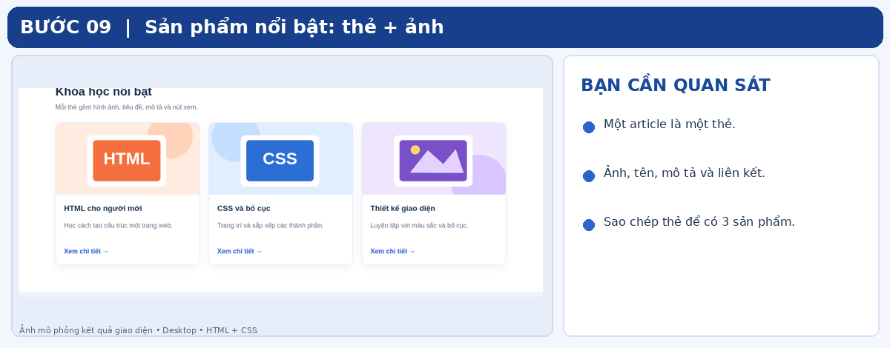

## BƯỚC 10 — Nội dung giới thiệu, thông báo và Footer

**Khái niệm:** *Introduction/About* giới thiệu đơn vị hoặc dự án; *notice/promotion* là khu vực thông báo/khuyến mãi; *Footer* là chân trang chứa liên hệ, bản quyền, liên kết phụ. Footer dùng thẻ `<footer>`, không phải đặt mọi nội dung vào `<div>` vô nghĩa. *Tái sử dụng CSS* nghĩa là một class `.container` có thể xuất hiện ở header, sections và footer.

**Khi nào dùng:** Đây là ba vùng cuối Home theo gợi ý trong đề bài. Tùy chủ đề, đổi “khuyến mãi” thành thông báo, sự kiện hoặc tin nổi bật.

**Thao tác:** Ngay sau section sản phẩm, **vẫn ở trong `<main>`**, thêm hai section:

```html
<section class="about-section" id="gioi-thieu">
  <div class="container">
    <h2>Về EduShop</h2>
    <p>Website mẫu giúp người mới học HTML và CSS.</p>
  </div>
</section>
<section class="container notice-section">
  <h2>Thông báo khóa học mới</h2>
  <p>Đây là thông tin minh họa, chưa có dữ liệu động.</p>
</section>
```

Sau hai section, đóng `</main>` rồi đặt footer:

```html
<footer class="site-footer">
  <div class="container">
    <h2>EduShop</h2>
    <p>Liên hệ: contact@example.com</p>
    <p>© 2026 EduShop</p>
  </div>
</footer>
```

CSS gợi ý:

```css
.about-section { background: #edf3ff; padding: 48px 0; margin-top: 65px; }
.notice-section { background: #fff4db; padding: 25px; margin-top: 60px; }
.site-footer { background: #102846; color: white; padding: 34px 0; }
```

**Giải thích:** `padding: 48px 0` là viết tắt: trên/dưới 48px, trái/phải 0. `id="gioi-thieu"` giúp liên kết Giới thiệu cuộn đúng vị trí. CSS `.site-footer` có thể để trong `style.css` để tái sử dụng khi thêm trang khác.

**Kết quả cần quan sát:** Home có đủ đầu trang, banner, tìm kiếm, danh mục, sản phẩm, giới thiệu, thông báo và chân trang. File mã nguồn mẫu có thêm chi tiết bố trí và màu sắc để ra kết quả dưới đây.

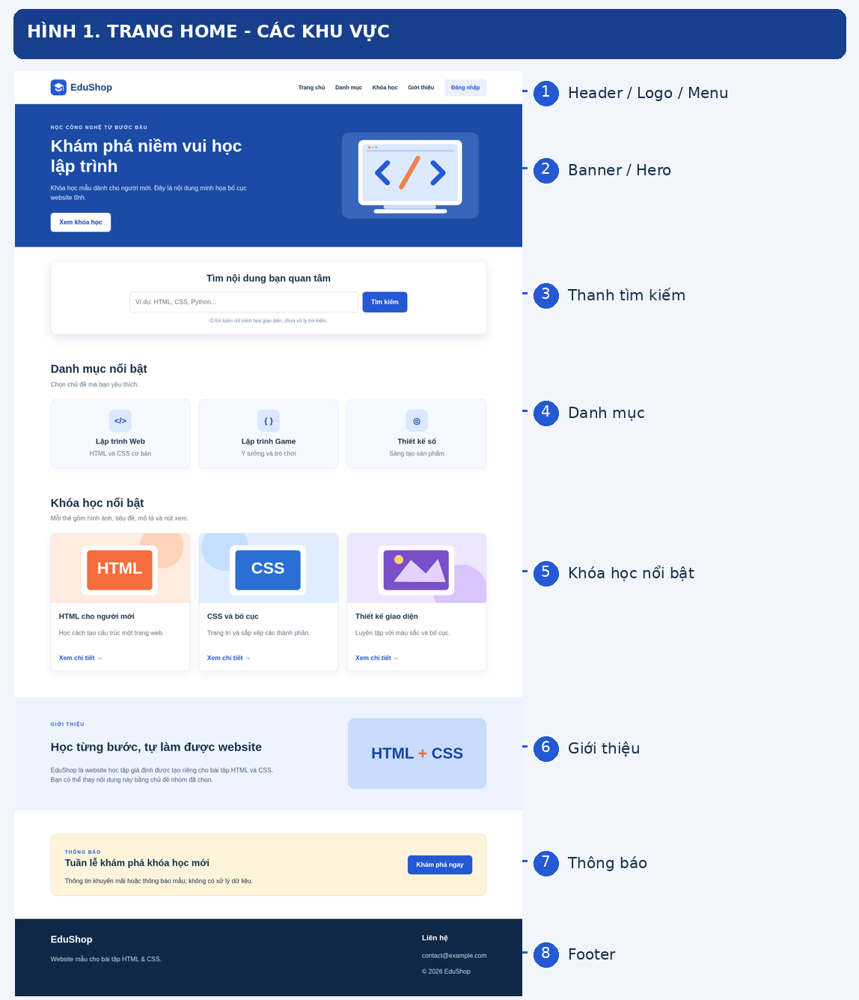

**Ghi chú đối chiếu đề:** Header/Logo và Navigation cùng nằm trong vùng số 1 của ảnh; tính riêng vẫn là hai thành phần. Trang Home đáp ứng đủ **9 nhóm thành phần** được nêu trong ảnh đề bài.

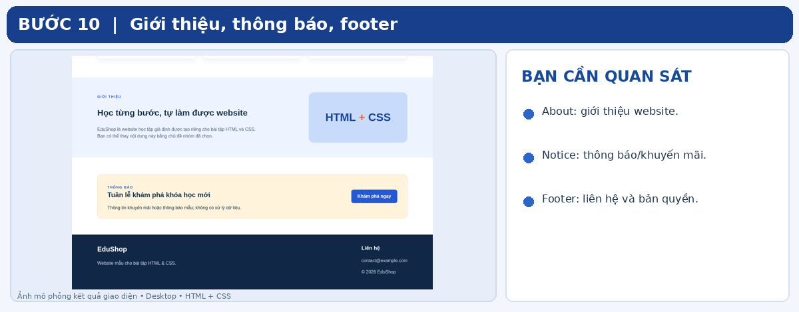

## BƯỚC 11 — Tạo khung trang Login riêng

**Khái niệm:** *Multiple pages* là website có nhiều file HTML. Hai file `index.html` và `login.html` có thể dùng chung `style.css`, đồng thời mỗi file dùng thêm CSS của riêng mình. *Form* là khu vực tập hợp các trường nhập liệu. Bài này sử dụng form để trình bày giao diện, không có hệ thống nhận dữ liệu.

**Khi nào dùng:** Thiết kế trang Đăng nhập độc lập, liên kết từ menu Home. Không cần dùng JavaScript để đổi màn hình.

**Thao tác:** Tạo/mở `login.html`:

```html
<!DOCTYPE html>
<html lang="vi">
<head>
  <meta charset="UTF-8">
  <title>EduShop - Đăng nhập</title>
  <link rel="stylesheet" href="css/style.css">
  <link rel="stylesheet" href="css/login.css">
</head>
<body class="login-page">
  <main class="login-layout">
    <div class="login-card">
      <h1>Đăng nhập</h1>
      <p>Chào mừng bạn trở lại!</p>
      <!-- Form sẽ được thêm ở bước 12. -->
    </div>
  </main>
</body>
</html>
```

**Giải thích:** `<!-- ... -->` là *comment* (chú thích HTML), trình duyệt không hiển thị như nội dung. `class="login-page"` gắn kiểu nền riêng cho Login; `login-layout` là vùng căn giữa; `login-card` là hộp chứa form.

**Kết quả cần quan sát:** Mở trực tiếp `login.html` thấy tiêu đề đăng nhập. Chưa có ô nhập là bình thường vì bước này chỉ dựng khung.

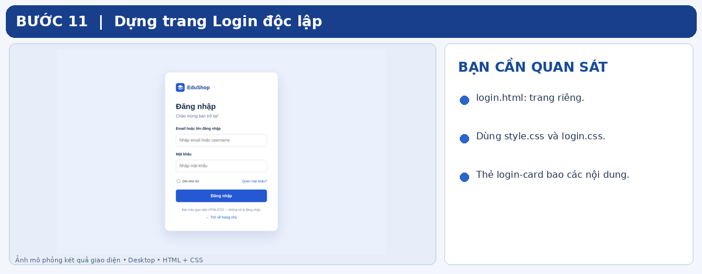

## BƯỚC 12 — Thêm form: label, username, password

**Khái niệm:** `<form>` nhóm biểu mẫu; `<label>` đặt nhãn cho trường; `<input>` là ô nhập liệu không có thẻ đóng. `id` là định danh duy nhất; `for="username"` trong label liên kết với `id="username"` của input — nhấp vào nhãn sẽ tập trung vào ô tương ứng. `type="text"` nhận văn bản; `type="password"` che ký tự được gõ **trên giao diện** nhưng **không phải** mã hóa hoặc xác thực bảo mật. `autocomplete` cung cấp gợi ý loại dữ liệu cho trình duyệt.

**Khi nào dùng:** Mọi giao diện đăng nhập cần nhãn rõ và trường mật khẩu che ký tự. Dùng HTML chuẩn thay vì vẽ ô giả bằng `div` vì ô HTML thật có thể nhận bàn phím.

**Thao tác:** Trong `.login-card`, ngay dưới `<p>Chào mừng...`, thêm:

```html
<form class="login-form">
  <label for="username">Email hoặc tên đăng nhập</label>
  <input id="username" type="text" placeholder="Nhập email hoặc username">

  <label for="password">Mật khẩu</label>
  <input id="password" type="password" placeholder="Nhập mật khẩu">
</form>
```

**Giải thích:** Đặt input phía sau label giúp người đọc nhìn thấy nhãn trước khi nhập. Trong bài này một ô nhận email **hoặc** username, nên dùng `type="text"`; `type="email"` sẽ yêu cầu định dạng email và không phù hợp khi cũng chấp nhận username. Chưa có `action` hay backend xử lý.

**Kết quả cần quan sát:** Gõ vào ô username sẽ thấy chữ; gõ vào ô mật khẩu sẽ thấy dấu chấm hoặc dấu sao tùy trình duyệt. Không nhập mật khẩu thật khi thử nghiệm, chỉ dùng dữ liệu giả.

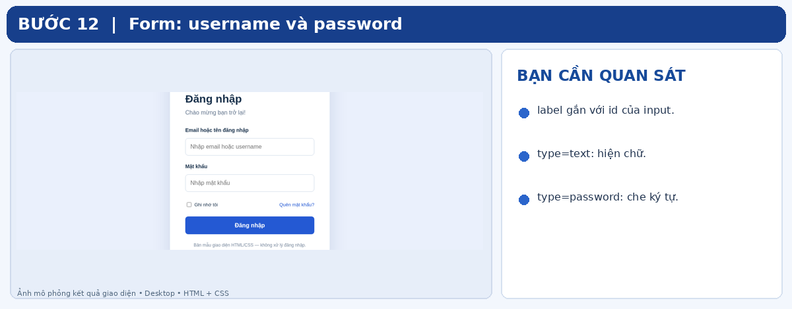

## BƯỚC 13 — Thêm Remember me, Forgot password và nút Login

**Khái niệm:** `type="checkbox"` tạo ô chọn; `href="#"` là liên kết tạm (*placeholder link*) và không có trang khôi phục mật khẩu thật; `<button type="button">` tạo nút không gửi form; nút `type="submit"` có hành vi gửi form mặc định, nên không dùng cho bản trình bày chưa xử lý dữ liệu. *UI interaction* (tương tác giao diện) là hành vi nhập/chọn/nhấp; nó khác *business logic* (nghiệp vụ) như kiểm tra tài khoản hay lưu trạng thái.

**Khi nào dùng:** Chỉ cần đáp ứng đủ 5 thành phần trang Login trong đề mà không hứa có chức năng thực tế.

**Thao tác:** Bên trong `<form>`, sau input mật khẩu và trước `</form>`, thêm:

```html
<div class="login-options">
  <label class="remember-label">
    <input type="checkbox"> Ghi nhớ tôi
  </label>
  <a href="#">Quên mật khẩu?</a>
</div>
<button type="button" class="button login-button">Đăng nhập</button>
```

**Giải thích:** Checkbox có thể bật/tắt vì trình duyệt đã hỗ trợ sẵn, nhưng chưa lưu trạng thái “ghi nhớ tôi” giữa các lần truy cập. “Quên mật khẩu?” là chữ có hình thức liên kết; vì không tạo trang tương ứng, khi nộp bài nên chú thích rõ **chưa có chức năng**. Nút Đăng nhập có thể có màu và hiệu ứng hover từ CSS nhưng không xác minh dữ liệu.

**Kết quả cần quan sát:** Form có hai ô, một checkbox, một liên kết và một nút. Nhấn checkbox thấy dấu chọn; nhấn Đăng nhập không chuyển trang, không báo thành công.

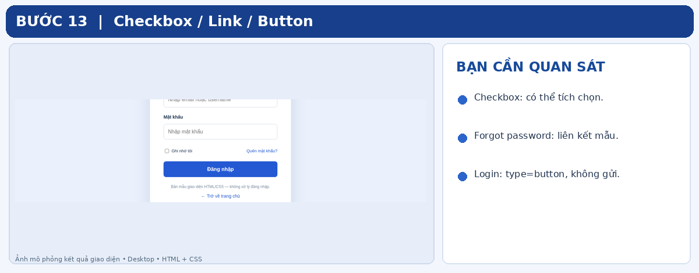

## BƯỚC 14 — Trang trí Login bằng CSS: căn giữa, tạo hộp và định dạng form

**Khái niệm:** *Viewport* là vùng hiển thị trang của trình duyệt; `100vh` nghĩa là chiều cao bằng 100% chiều cao viewport. `min-height` là chiều cao tối thiểu. `border-radius` bo góc, `box-shadow` tạo bóng; `:focus` áp dụng kiểu khi ô được chọn; `:hover` áp dụng kiểu khi trỏ chuột lên phần tử. *Pseudo-class* (`:focus`, `:hover`) là trạng thái CSS có sẵn, **không cần JavaScript**.

**Khi nào dùng:** Căn form vào giữa trang Login trên desktop; cho người dùng biết ô nào đang được nhập và nút nào đang được trỏ chuột.

**Thao tác:** Trong `css/login.css` viết:

```css
.login-page { background: #eaf0fc; }
.login-layout {
  min-height: 100vh;
  display: flex;
  justify-content: center;
  align-items: center;
}
.login-card {
  width: 440px;
  padding: 42px;
  background: white;
  border-radius: 18px;
  box-shadow: 0 20px 50px #122e6520;
}
.login-form { display: flex; flex-direction: column; gap: 11px; }
.login-form > input { height: 48px; padding: 0 13px; border: 1px solid #cbd7e6; }
.login-form > input:focus { outline: 2px solid #2459d3; }
.login-button { width: 100%; }
```

**Giải thích:** `flex-direction: column` xếp các phần tử form theo cột thay vì hàng. Dấu `>` trong `.login-form > input` chỉ chọn các input **con trực tiếp** của form, nhờ vậy không vô tình áp dụng chiều cao 48px cho checkbox nằm sâu trong `.login-options`. `box-shadow` gồm dịch ngang, dịch dọc, độ nhòe và màu; `#122e6520` là màu hex có kênh trong suốt. CSS đầy đủ trong file mẫu sẽ thêm căn chỉnh các phần còn lại.

**Kết quả cần quan sát:** Một tấm thẻ màu trắng ở giữa nền xanh rất nhạt, ô nhập xếp dọc và nút xanh chiếm toàn chiều rộng thẻ.

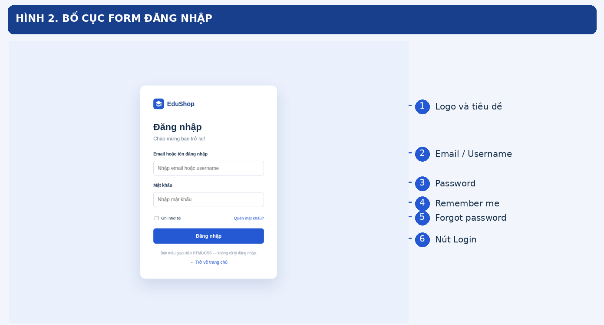

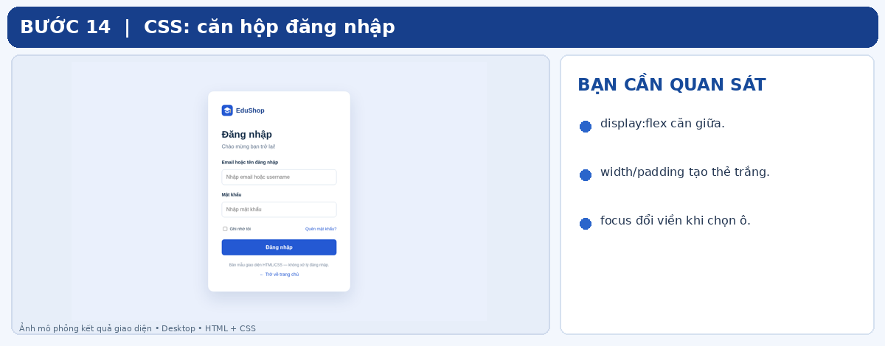

## BƯỚC 15 — Tự thao tác giao diện và kiểm tra đúng phạm vi

**Khái niệm:** *Test (kiểm thử)* là thực hiện thao tác và so sánh với kết quả mong đợi. *Static website* (website tĩnh) có thể hiển thị chữ, ảnh, liên kết, nhận chữ vào input và đổi trạng thái checkbox; nhưng không tự có hệ thống đăng nhập/tìm kiếm dữ liệu. *Refresh* tải lại trang, thường dùng Ctrl + R.

**Khi nào dùng:** Sau mỗi phần và trước khi nộp để kiểm tra lỗi thực tế thay vì chỉ nhìn mã.

**Thao tác theo thứ tự:**

1. Ctrl + S toàn bộ file HTML/CSS; mở `index.html`; nhấn Ctrl + R.
2. Xác nhận Home có đủ 9 nhóm: Header/Logo, Menu, Hero, tìm kiếm, danh mục, sản phẩm, giới thiệu, thông báo, footer. Header và menu có thể nằm chung một hàng.
3. Nhấp **Danh mục / Khóa học / Giới thiệu**: trang cuộn đến khu vực chứa `id` đúng.
4. Nhấp **Đăng nhập** trên menu: trình duyệt mở `login.html`.
5. Nhập `hocvien01` vào username và chuỗi giả `123456` vào password. Kiểm tra password hiển thị dưới dạng chấm/sao.
6. Tích **Ghi nhớ tôi**: phải có dấu chọn. Nhấn **Đăng nhập**: **không được** hiện thông báo giả “đăng nhập thành công”, không gửi dữ liệu đến dịch vụ nào.
7. Nhấp **Trở về trang chủ**: mở lại `index.html`.
8. Trên Home, thử nhấn **Tìm kiếm**: không có thuật toán tìm kiếm và không cần có kết quả.

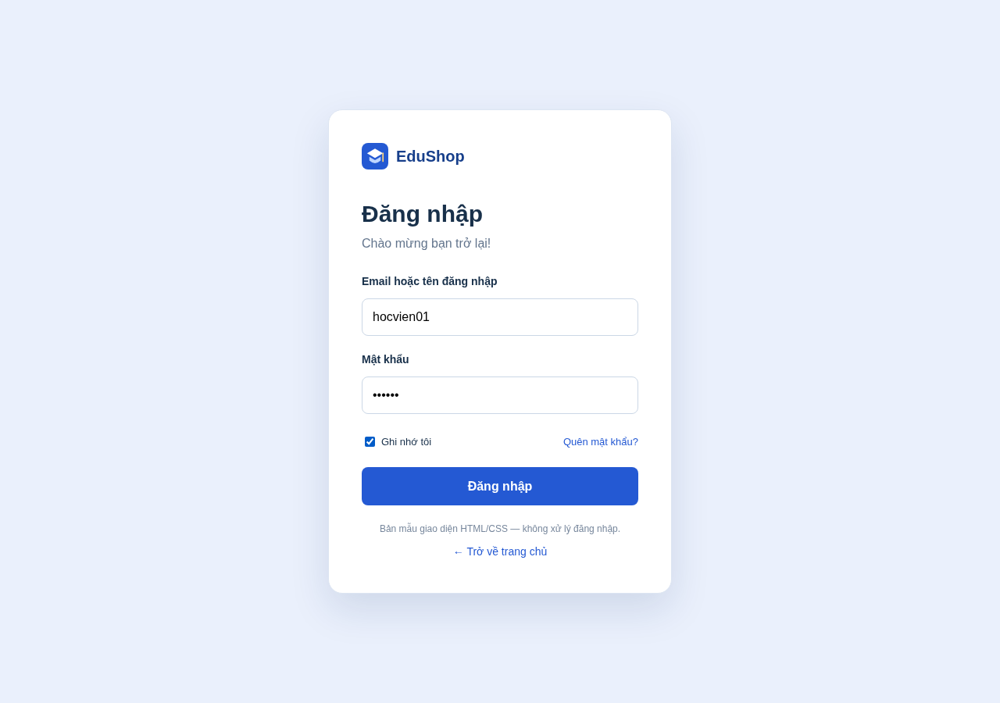

**Kết quả cần quan sát:** Các thao tác giao diện bản địa của HTML hoạt động; không có xử lý dữ liệu phía sau. Nếu Home hoặc Login trắng trơn, xem bước 16.

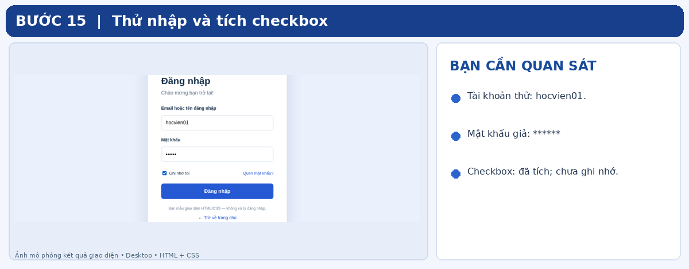

## BƯỚC 16 — Gỡ lỗi thường gặp và bàn giao bài nhóm

**Khái niệm:** *Debug* là xác định nguyên nhân và sửa lỗi. *File path* sai, quên lưu file, cú pháp thẻ không khớp hoặc quên liên kết CSS là những lỗi phổ biến nhất với người mới. *Bàn giao* nghĩa là gửi đúng bộ mã nguồn và thông tin phân công để người khác mở được.

| Hiện tượng | Nguyên nhân thường gặp | Cách khắc phục |
|---|---|---|
| Trang chỉ có chữ, không có màu | Thiếu `<link>` hoặc sai đường dẫn CSS | Kiểm tra `href="css/style.css"`, `href="css/home.css"` hoặc `href="css/login.css"` |
| Logo/ảnh bị hỏng | Không có file, sai tên file hoặc `src` | Kiểm tra thư mục `assets/` và chuỗi `src="assets/..."` |
| Nội dung chen vào nhau | Đóng thiếu `</div>`, `</section>` hoặc `</main>` | Căn thụt lề và kiểm tra cặp thẻ mở/đóng |
| Menu không cuộn đúng | `href="#san-pham"` khác `id="san-pham"` | Làm cho hai giá trị khớp từng ký tự; mỗi ID chỉ dùng một lần trên một trang |
| CSS vừa sửa nhưng không thay đổi | Chưa Ctrl + S hoặc chưa Ctrl + R | Lưu file rồi tải lại trang |
| Trang đăng nhập không có nền/thẻ | Quên link `css/login.css` | Kiểm tra `<head>` của `login.html` |
| Nhấn Login không đăng nhập | Không có hệ thống xác thực | Đây là kết quả **đúng** với bài tập chỉ làm layout |
| Giao diện vượt chiều ngang màn hình nhỏ | Bố cục desktop cố định 1100px | Bài này chủ động **bỏ qua responsive**, nên kiểm tra ở cửa sổ desktop đủ rộng |

**Bàn giao:** Nén thư mục website chứa đủ `index.html`, `login.html`, `css/`, `assets/`; không chỉ gửi ảnh chụp. Đính kèm bảng phân công: tên thành viên, hạng mục, phần HTML/CSS trực tiếp làm, file liên quan; người tích hợp kiểm tra tổng thể và liên kết. Các thành viên nên tự giải thích được những thẻ/class mình viết.

**Tiêu chí tự kiểm:** (1) Home đầy đủ 9 thành phần đề bài; (2) Login đầy đủ 5 mục; (3) chỉ HTML/CSS; (4) không lỗi ảnh/đường dẫn; (5) bố cục desktop rõ ràng; (6) có bảng phân công minh bạch. Các tính năng tìm kiếm, đăng nhập, ghi nhớ, khôi phục mật khẩu **không nằm trong phạm vi**.

---

## TỰ LUYỆN: CHUYỂN MẪU EDUShop THÀNH ĐỀ TÀI NHÓM

Giữ cấu trúc HTML/CSS vừa làm, đổi tên logo/website, nội dung Hero, ba danh mục, ba thẻ sản phẩm/dịch vụ, phần giới thiệu và thông báo. Ví dụ nhóm chọn **website bán sách** thì “Khóa học nổi bật” đổi thành “Sách nổi bật”, ảnh khóa học đổi thành bìa sách, “Danh mục” đổi thành thể loại. **Không tự thêm chức năng mua hàng, đăng nhập hoặc tìm kiếm thật.** Khi đổi ảnh, cập nhật đúng `src` và `alt`.

### Từ điển tra nhanh

| Thuật ngữ | Hiểu thật ngắn | Ví dụ trong bài |
|---|---|---|
| HTML | Cấu trúc và nội dung | `<h1>Đăng nhập</h1>` |
| CSS | Giao diện, màu, bố cục | `.login-card { width: 440px; }` |
| Element | Một phần tử HTML | `<p>Giới thiệu</p>` |
| Attribute | Thông tin bổ sung trong thẻ | `href="login.html"` |
| Class | Tên dùng lại cho nhiều phần tử | `class="container"` |
| ID | Tên định danh duy nhất trong một trang | `id="san-pham"` |
| Selector | Cách CSS tìm phần tử HTML | `.product-card` |
| Flexbox | Bố cục một hàng/cột | Header, nhóm tìm kiếm |
| Grid | Bố cục dạng lưới | Ba thẻ danh mục/sản phẩm |
| Box Model | Content + padding + border + margin | Thẻ Login |
| Static website | Website không có xử lý nghiệp vụ ở phía sau | Hai trang của bài tập |
| `href` | Đích liên kết | `href="index.html"` |
| `src` | Nguồn ảnh | `src="assets/logo.svg"` |
| `type="button"` | Nút không gửi form | Nút Login mô phỏng |

**Thứ tự làm tối ưu:** Khung file → HTML cấu trúc Home → CSS chung → CSS Home → HTML Login → CSS Login → thao tác kiểm thử → chỉnh nội dung theo đề tài → bàn giao. Nếu mã bị rối, so sánh từng file với mã nguồn hoàn chỉnh trong thư mục đi kèm; không cần tự suy đoán một khối còn thiếu nằm ở đâu.

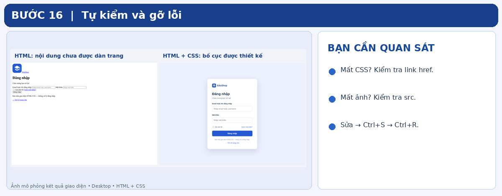

